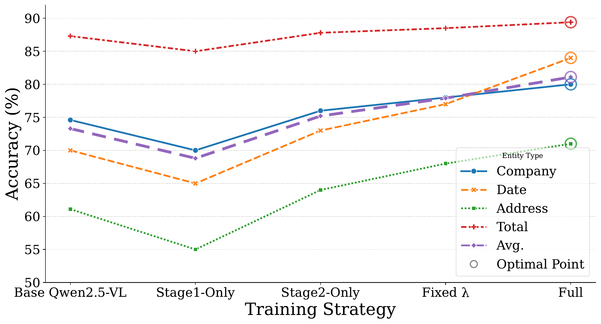

# Doc-SCoT: Adaptive Hierarchical Structural Tokens for Document Image Understanding

> **Status:** Manuscript under review.

Implementation of **Doc-SCoT**. Document image understanding requires modeling
structure at multiple levels — local text boundaries, regional layout, and global reading flow.
Existing VLMs encode these implicitly, or serialize them into discrete text and coordinates,
which degrades structural information and applies the *same* computation to every document
regardless of complexity.

Doc-SCoT instead represents structure with **continuous structural tokens of adaptive length**,
interleaved with autoregressive reasoning.


## Method

Structure is decomposed into three complementary levels, each carried by continuous visual
thought tokens and grounded on a frozen specialist during training:

| Branch   | Level                  | Teacher (alignment target)                        | Decode field     |
|----------|------------------------|---------------------------------------------------|------------------|
| `det`    | local text boundaries  | DBNet (doctr ResNet50), FPN neck features         | 128x128          |
| `layout` | regional layout        | DocLayout-YOLO, neck features                     | 32x32            |
| `flow`   | global reading flow    | DBNet neck + 8 coordinate channels + LayoutReader | 128x128 + coords |

Each branch has its own projection head, a 4-row query bank, and a cross-attention decoder that
queries the specialist's spatial feature field with the LLM hidden states of that branch's tokens.

### Two-stage training



1. **Structure Alignment SFT** — structural tokens reconstruct the frozen specialists' dense
   signals (latent feature reconstruction), which grounds them in document geometry. Stage 1 is
   a visual-only alignment phase; stage 2 adds question answering and linearly decays the visual
   loss weight.
2. **Budget Allocation GRPO** — a group-relative policy-gradient stage whose reward balances
   answer quality, format compliance, structural-token cost, and structural alignment residual.
   This is how the model learns *how many* tokens each document needs.

Budget per branch is `k in {0, 2, 4, 6}`; `k = 0` **omits the whole step**, i.e. branch-level
selection. A single-column receipt can therefore drop the reading-flow step entirely.

At inference **no specialist is needed**: the model emits its own structural tokens and answers
the question. Dense predictions can optionally be decoded for interpretability.

## Installation

```bash
conda create -n doc-scot python=3.10 -y
conda activate doc-scot
pip install -r requirements.txt
```

Base model: `Qwen/Qwen3-VL-8B-Instruct` (set `MODEL_ID`).

Two external checkpoints are used **only as teachers during training** and are never needed at
inference:

- **LayoutReader** — reading order prediction. Set `LAYOUTREADER_MODEL_PATH`.
- **DocLayout-YOLO (DocStructBench)** — layout detection. Set `LAYOUT_MODEL_PATH`.

DBNet comes from `python-doctr` and needs no local file.

## Data format

Each dataset is a single JSON list. One item:

```json
{
  "image": "xxx.png",
  "conversations": [
    {"from": "human", "value": "<image>\nWhat is the total amount?"},
    {"from": "gpt",   "value": "<answer>12.50</answer>"}
  ]
}
```

Images live in an `images/` folder next to `data.json`.

### Adaptive budget table

`train/src/training/data.py` reads the JSON path in `ANCHOR_BUDGET_FILE`, which maps an image
basename to its per-branch token counts, e.g. `{"xxx.png": {"det": 4, "layout": 2, "flow": 0}}`.
When the variable is unset, or an image is not in the table, it falls back to a fixed 4/4/4.

The table is derived offline from teacher signals — token count should be proportional to how much
information that branch has to express, and a branch with trivial information should disappear:

- `k_det` <- number of word boxes (text amount)
- `k_layout` <- number of layout blocks
- `k_flow` <- number of y-coordinate back-jumps in reading order (column / region wraps)

```bash
python tool/build_dataset_cache.py --data-path <data.json> --image-folder <images/> --out <teacher_cache/>
python tool/build_anchor_budget.py --cache-dir <teacher_cache/> --out <anchor_budget.json>
```

`build_dataset_cache.py` stores the *raw* teacher material (features, boxes, word order), not the
finished targets, so the bucketing thresholds in `build_anchor_budget.py` can be retuned without
re-running the teachers. On a cache miss the code falls back to online teacher inference.

### Indexed slot tokens

By default a branch emits the same pad token `k` times. Setting `ANCHOR_INDEXED_TOKENS=1` switches
to distinct per-slot tokens `<|det_1|>...<|det_8|>`. Repeating one token forces the model to count
implicitly, which transformers are poor at; distinct slots make "how many to emit" explicit state
and let slots specialize semantically.

## Training

```bash
# Stage 1+2: Structure Alignment SFT, then merge LoRA
bash train/scripts/run_sft.sh

# Budget Allocation GRPO, starting from the merged SFT checkpoint
SFT_MODEL=<run_dir>/lora_merged bash train/scripts/run_rl.sh
```

Both scripts read `BASE_DIR`, `MODEL_ID`, `DATASET_DIR` and the teacher paths from the
environment; defaults point at a local layout, so override them for your machine.

Key knobs (see `train/src/training/params.py`):

- `--stage_1_steps` — length of the visual-only alignment stage, in optimizer steps.
- `--visual_weight_start` / `--visual_weight_end` / `--linear_visual_weight_decay` — stage-2
  visual loss schedule.
- `--prefix_supervision`, `--charge_absent_branches` — stronger structural supervision
  (off by default; older checkpoints keep their original behaviour).

GRPO knobs (see `train/src/training/train_rl.py`):

- `--w_token` (cost of visual tokens) and `--w_align` (alignment residual) pull in opposite
  directions; their equilibrium is the budget an image actually needs. With `--w_token` alone the
  optimal policy is to emit nothing, and the budget collapses to zero.
- `--w_cot_fmt` — grammar reward for the variable-length CoT (label order, token placement,
  per-branch capacity).
- `--charge_absent_branches` must be on when `--w_align > 0`, otherwise an omitted branch costs
  nothing and "omit everything" becomes free again.

## Evaluation

`eval/` contains both the metric implementations and end-to-end inference scripts.

Metrics (read a predictions file and a ground-truth file, report `evaluation_results.json`):

```bash
python eval/eval_cord.py --pred <pred.json> --gt <gt.json>
```

Inference + metric, one script per benchmark (CORD / FUNSD / POIE / SROIE / DocVQA / InfoVQA /
VisualMRC):

```bash
python eval/run_cord_doc_covt.py --model_path <merged_checkpoint> --test_data <cord_test.json> ...
```

## Demo

```bash
MODEL_PATH=<merged_checkpoint> python gradio/demo.py
```

## Notes on the environment

The code targets `Qwen3VLForConditionalGeneration` and PyTorch 2.5.x. A few compatibility shims
are deliberate, not bugs:

- `train.py` disables `check_torch_load_is_safe`. torch 2.5.1 fails this check behind newer
  transformers, and it only ever reloads our own resume checkpoints.
- `anchor_teachers.py` patches two `huggingface_hub` symbols removed in 1.x before importing
  `doctr`, which touches them only in its push-to-hub path.
- `covt_qwen3_vl.py::_init_weights` explicitly initializes `nn.MultiheadAttention` and the raw
  query-bank parameters: transformers loads on a meta device, so the defaults set in `__init__`
  are discarded and the base `_init_weights` does not recognize these modules, leaving
  uninitialized memory (occasionally NaN).
- `_gather_anchor_hidden` right-pads each sample's anchor hidden states to the batch maximum and
  returns a `key_padding_mask`, because under adaptive budgets every sample emits a different
  number of tokens.

## Citation

The paper is currently under review. Until it appears, please cite the manuscript as:

```bibtex
@misc{qian2027docscot,
  title={Doc-SCoT: Adaptive Hierarchical Structural Tokens for Document Image Understanding},
  author={Qian, Wentao and Zheng, Xiaohan and Zhuang, Liansheng},
  year={2027},
  note={Manuscript under review}
}
```

This entry will be replaced with the final venue once the paper is published.

## License

Apache-2.0. Third-party components (Qwen3-VL, DBNet/doctr, DocLayout-YOLO, LayoutReader) remain
under their own licenses.
