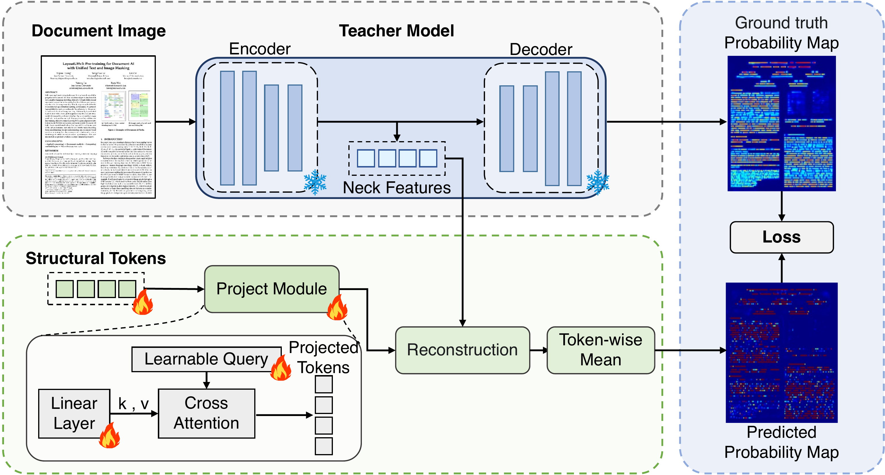

# Doc-SCoT: Adaptive Hierarchical Structural Tokens for Document Image Understanding

> **Status:** Manuscript under review.

Implementation of **Doc-SCoT**. Document image understanding requires modeling
structure at multiple levels — local text boundaries, regional layout, and global reading flow.
Existing VLMs encode these implicitly, or serialize them into discrete text and coordinates,
which degrades structural information and applies the *same* computation to every document
regardless of complexity.

Doc-SCoT instead represents structure with **continuous structural tokens of adaptive length**,
interleaved with autoregressive reasoning.


## Method

Given a document image `I` and a question `Q`, Doc-SCoT autoregressively generates a structural
sequence `S` followed by answer tokens `A`:

```
S = T_d^(1:k_d) || T_l^(1:k_l) || T_f^(1:k_f)
p_theta(S, A | I, Q) = prod_t p_theta(y_t | I, Q, y_<t)
```

`T_d`, `T_l`, `T_f` are detection, layout, and reading-flow tokens, and `k_d, k_l, k_f` their
input-dependent budgets. A branch is omitted when its budget is zero. `S` is enclosed by
`<think>` tags and precedes `A`, enclosed by `<answer>` tags, so its continuous hidden states
condition answer generation directly.

### Hierarchical Structural Token Grounding

The three token types describe structure at increasing spatial scope: detection tokens encode
local text boundaries, layout tokens represent regional elements and their organization, and
reading-flow tokens capture sequential relations among regions. They are generated in a
local-to-global order and jointly condition the answer.

Each branch is grounded on a document specialist — docTR DBNet for text regions, DocLayout-YOLO
for layout elements, and LayoutReader for reading flow:

| Branch   | Level                   | Specialist                        | Reconstructed map |
|----------|-------------------------|-----------------------------------|-------------------|
| `det`    | local text boundaries   | docTR DBNet (probability map)     | MSE               |
| `layout` | regional layout         | DocLayout-YOLO (semantic raster)  | MSE + L1          |
| `flow`   | reading flow            | LayoutReader (ordered regions)    | pairwise ranking + region-mask |

A bank of `m = 4` learnable queries aggregates each branch's variable-length hidden states into
fixed-size readout vectors, which act as dynamic kernels over the branch's frozen specialist
feature map:

```
H_bar_s = Norm(H_s W_s)
Z_s     = MHA(Q_s, H_bar_s, H_bar_s)
M_hat_s = sigmoid( (1/m) * sum_r rho_s(z_{s,r} F_s) )
```

The readout is instantiated per branch with its own parameters; the same design supports variable
budgets.



### Structure Alignment SFT

Structure Alignment SFT progressively balances structural grounding and language generation:

```
L_SFT = L_CE + lambda(t) * L_str,    L_str = L_det + L_layout + L_flow
```

`lambda(t)` starts large and decays linearly with training steps, shifting the emphasis from
structural grounding to language generation. Because each branch decodes its tokens back to the
specialist signal, answer generation is conditioned on this grounded structure.

The token budget of each level is derived per image from three structural signals: detected
words, layout blocks, and vertical reading-order wraps. Each level takes `k_d, k_l, k_f` in
`{0, 2, 4, 6}` tokens according to its signal size, and a level whose signal is trivial is
omitted entirely (`k = 0`). The total is capped at `18`, and each image is supervised at its own
budget. A single-column receipt can therefore drop the reading-flow level entirely.

### Budget Allocation GRPO

SFT supplies a structured allocation prior but does not directly optimize the quality–cost
trade-off. Starting from the SFT model, the forced structural prefix is removed and GRPO is
applied over complete sampled responses; each rollout decides whether a branch is present and how
many tokens it emits. The reward is

```
R = lambda_1 R_acc + lambda_2 R_fmt + lambda_3 R_bud + lambda_4 R_align
```

- `R_acc` — answer correctness.
- `R_fmt` — output-format validity: well-formed `<answer>` tags and a syntactically valid
  structural sequence.
- `R_bud = -N_vis / N_cap` — penalizes unnecessary structural tokens.
- `R_align = -L_str` — prevents suppressing structurally necessary branches, since an omitted
  branch is still decoded from its learnable query prior and incurs the corresponding
  reconstruction error.

For `G` sampled responses, the group-relative advantage is `A_hat_i = R_i - (1/G) sum_j R_j`, and
the policy is optimized as

```
L_GRPO = -(1/G) sum_i A_hat_i log p_theta(Y_i | I, Q) + beta * KL(pi_theta || pi_ref)
```

with `pi_ref` the frozen SFT policy. No cross-entropy or separate structural auxiliary loss is
added during GRPO; `L_str` enters optimization only through the reward above. SFT learns what the
structural tokens represent, whereas GRPO learns when each level is useful and how much capacity
it requires.

At inference **no specialist is needed**: the model emits its own structural tokens and answers
the question. Dense predictions can optionally be decoded for interpretability.

## Installation

```bash
conda create -n doc-scot python=3.10 -y
conda activate doc-scot
pip install -r requirements.txt
```

Base model: `Qwen/Qwen3-VL-8B-Instruct` (set `MODEL_ID`).

Two external checkpoints act as **specialists** and are needed only during training, never at
inference. (The code and CLI flags call them `teacher` / `anchor`; the paper calls them
specialists — same thing.)

- **LayoutReader** — reading flow. Set `LAYOUTREADER_MODEL_PATH`.
- **DocLayout-YOLO (DocStructBench)** — layout elements. Set `LAYOUT_MODEL_PATH`.

DBNet comes from `python-doctr` and needs no local file.

## Data format

Each dataset is a single JSON list. One item:

```json
{
  "image": "xxx.png",
  "conversations": [
    {"from": "human", "value": "<image>\nWhat is the total amount?"},
    {"from": "gpt",   "value": "12.50"}
  ]
}
```

Images live in an `images/` folder next to `data.json`.

The `gpt` value is the plain answer. Neither the `<think>` block nor the `<answer>` tags appear
in the dataset — both are added by the preprocessing code at load time
(`get_stage2_data` in `train/src/training/data.py`), which wraps the answer as
`<think>...</think>\n<answer> ... </answer>`. Datasets therefore stay in ordinary QA form and the
structural sequence is regenerated per image from the budget table.

### Adaptive budget table

`train/src/training/data.py` reads the JSON path in `ANCHOR_BUDGET_FILE`, which maps an image
basename to its per-branch token counts, e.g. `{"xxx.png": {"det": 4, "layout": 2, "flow": 0}}`.
When the variable is unset, or an image is not in the table, it falls back to a fixed 4/4/4.

The table is derived offline from specialist signals — token count should be proportional to how
much information that level has to express, and a level with trivial information should disappear
entirely:

- `k_det` <- number of word boxes (text amount)
- `k_layout` <- number of layout blocks
- `k_flow` <- number of y-coordinate back-jumps in reading order (column / region wraps)

```bash
python tool/build_dataset_cache.py --data-path <data.json> --image-folder <images/> --out <teacher_cache/>
python tool/build_anchor_budget.py --cache-dir <teacher_cache/> --out <anchor_budget.json>
```

`build_dataset_cache.py` stores the *raw* teacher material (features, boxes, word order), not the
finished targets, so the bucketing thresholds in `build_anchor_budget.py` can be retuned without
re-running the teachers. On a cache miss the code falls back to online teacher inference.

### Indexed slot tokens

By default a branch emits the same pad token `k` times. Setting `ANCHOR_INDEXED_TOKENS=1` switches
to distinct per-slot tokens `<|det_1|>...<|det_8|>`. Repeating one token forces the model to count
implicitly, which transformers are poor at; distinct slots make "how many to emit" explicit state
and let slots specialize semantically.

## Training

```bash
# Structure Alignment SFT, then merge LoRA
bash train/scripts/run_sft.sh

# Budget Allocation GRPO, starting from the merged SFT checkpoint
SFT_MODEL=<run_dir>/lora_merged bash train/scripts/run_rl.sh
```

Both scripts read `BASE_DIR`, `MODEL_ID`, `DATASET_DIR` and the specialist paths from the
environment; defaults point at a local layout, so override them for your machine.

Key knobs (see `train/src/training/params.py`):

- `--stage_1_steps` — length of the initial alignment phase, in optimizer steps.
- `--visual_weight_start` / `--visual_weight_end` / `--linear_visual_weight_decay` — the
  schedule for `lambda(t)`, the weight of `L_str` in `L_SFT`. It starts high and decays linearly,
  shifting emphasis from structural grounding to language generation.
- `--prefix_supervision`, `--charge_absent_branches` — stronger structural supervision
  (off by default; older checkpoints keep their original behaviour).

GRPO knobs (see `train/src/training/train_rl.py`):

- `--w_token` is `lambda_3` and `--w_align` is `lambda_4`, the weights of `R_bud` and `R_align`.
  They pull in opposite directions; their equilibrium is the budget an image actually needs. With
  `--w_token` alone the optimal policy is to emit nothing, and the budget collapses to zero.
- `--w_cot_fmt` — `lambda_2`, the grammar reward for the structural sequence (label order, token
  placement, per-level capacity).
- `--charge_absent_branches` must be on when `--w_align > 0`, otherwise omitting a branch costs
  nothing and `R_align` no longer reflects the reconstruction error described above.

## Evaluation

`eval/` contains both the metric implementations and end-to-end inference scripts.

Metrics read a predictions file and a ground-truth file and write `evaluation_results.json`:

```bash
python eval/eval_cord.py --output_file <predictions.json> --test_data <cord_test.json>
```

Inference + metric, one script per benchmark (CORD / FUNSD / POIE / SROIE / DocVQA / InfoVQA /
VisualMRC). These scripts take their paths from environment variables:

```bash
EVAL_MODEL_PATH=<merged_checkpoint> \
EVAL_DATA_PATH=<cord_test.json> \
EVAL_IMAGE_FOLDER=<images/> \
EVAL_OUTPUT_BASE=<result_dir> \
python eval/run_cord_doc_covt.py
```

## Demo

```bash
MODEL_PATH=<merged_checkpoint> python gradio/demo.py
```

## Notes on the environment

The code targets `Qwen3VLForConditionalGeneration` and PyTorch 2.5.x. A few compatibility shims
are deliberate, not bugs:

- `train.py` disables `check_torch_load_is_safe`. torch 2.5.1 fails this check behind newer
  transformers, and it only ever reloads our own resume checkpoints.
- `anchor_teachers.py` patches two `huggingface_hub` symbols removed in 1.x before importing
  `doctr`, which touches them only in its push-to-hub path.
- `covt_qwen3_vl.py::_init_weights` explicitly initializes `nn.MultiheadAttention` and the raw
  query-bank parameters: transformers loads on a meta device, so the defaults set in `__init__`
  are discarded and the base `_init_weights` does not recognize these modules, leaving
  uninitialized memory (occasionally NaN).
- `_gather_anchor_hidden` right-pads each sample's anchor hidden states to the batch maximum and
  returns a `key_padding_mask`, because under adaptive budgets every sample emits a different
  number of tokens.

## Citation

The paper is currently under review. Until it appears, please cite the manuscript as:

```bibtex
@misc{qian2027docscot,
  title={Doc-SCoT: Adaptive Hierarchical Structural Tokens for Document Image Understanding},
  author={Qian, Wentao and Zheng, Xiaohan and Zhuang, Liansheng},
  year={2027},
  note={Manuscript under review}
}
```

This entry will be replaced with the final venue once the paper is published.

## License

Apache-2.0. Third-party components (Qwen3-VL, DBNet/doctr, DocLayout-YOLO, LayoutReader) remain
under their own licenses.
