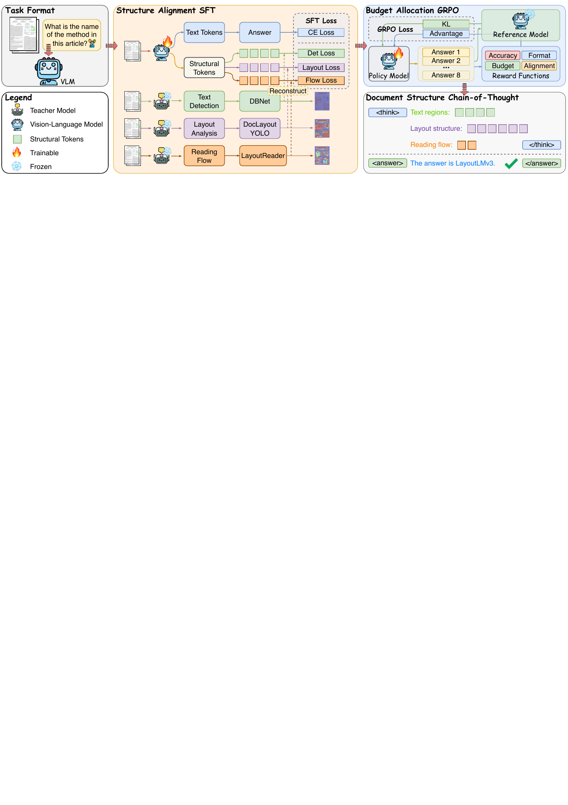

# Doc-SCoT

**Adaptive Hierarchical Structural Tokens for Document Image Understanding**

Document image understanding requires modeling structure at multiple levels — local text
boundaries, regional layout and global reading flow — but existing VLMs either encode it
implicitly in visual features or serialize it into discrete text and coordinates, and they
spend the same computation on every document regardless of its complexity. Doc-SCoT instead
represents structure with **continuous structural tokens of adaptive length**, interleaved
with autoregressive reasoning.



Given a document image and a question, Doc-SCoT

1. **Hierarchical Structural Token Grounding** — detection tokens encode local text
   boundaries, layout tokens represent regional elements and their organization, and
   reading-flow tokens capture sequential relations among regions. A bank of `m = 4`
   learnable queries reads each branch's variable-length hidden states into fixed-size
   readout vectors `Z_s = MHA(Q_s, H̄_s, H̄_s)`, which act as dynamic kernels over the
   branch's frozen specialist feature map,
   `M̂_s = σ((1/m) Σ_r ρ_s(z_{s,r} F_s))`. Specialists: docTR DBNet supervised by MSE on its
   probability map, DocLayout-YOLO by MSE + L1 on its semantic raster, and LayoutReader by
   pairwise ranking plus a region-mask loss;
2. **Structure Alignment SFT** — grounds these tokens by reconstructing the specialists'
   dense signals, `L_SFT = L_CE + λ(t)·L_str` with `λ(t)` decaying linearly so the emphasis
   shifts from structural grounding to language generation. Each level takes `k ∈ {0,2,4,6}`
   tokens derived per image from its own signal size — detected words, layout blocks,
   vertical reading-order wraps — and a level whose signal is trivial is omitted entirely
   (`k = 0`); the total is capped at 18;
3. **Budget Allocation GRPO** — starting from the SFT model with the forced structural prefix
   removed, optimizes `R = λ₁R_acc + λ₂R_fmt + λ₃R_bud + λ₄R_align` under the group-relative
   advantage, so the model learns *when* each level is useful and *how much capacity* it
   needs. `R_bud = -N_vis/N_cap` penalizes unnecessary tokens, while `R_align = -L_str`
   prevents suppressing structurally necessary branches, since an omitted branch is still
   decoded from its query prior and incurs the reconstruction error.

The result: on seven document VQA and VIE benchmarks, Doc-SCoT improves over its Qwen3-VL
backbone and outperforms both OCR-free and OCR-based methods, while no specialist is needed
at inference.

## Installation

```bash
conda create -n doc-scot python=3.10 -y
conda activate doc-scot
pip install -r requirements.txt
```

The code targets `transformers` 5.x (`Qwen3VLForConditionalGeneration`) together with PyTorch
2.5.1. That pairing has a known `torch.load` compatibility conflict, which `train.py` works
around since it only ever reloads this project's own resume checkpoints.

## Dataset Preparation

We use seven public benchmarks: four for visual information extraction — **CORD**,
**SROIE**, **FUNSD**, **POIE** — and three for document VQA — **DocVQA**,
**InfographicVQA**, **VisualMRC**. Each dataset is subject to its own license; please
download it from the official source.

Place them under the unified convention:

```
dataset/{cord,sroie,funsd,poie,docvqa,infovqa,visualmrc}/
├── data.json
└── images/
```

Each `data.json` is a JSON list. One item:

```json
{
  "id": "receipt_00000_0",
  "image": "images/receipt_00000.png",
  "conversations": [
    {"from": "human", "value": "<image>\nWhat is the \"total price\" in the given receipt?"},
    {"from": "gpt",   "value": "12.50"}
  ]
}
```

* `image` may be an absolute path or a bare filename; a bare name is resolved against the
  `--image_folder` argument.
* `conversations` carries the question in the human turn and the answer in the gpt turn. The
  answer is stored plain, without `<think>` or `<answer>` tags; those are added at training
  time.

### Token budget

The per-image token budget is read from the JSON file named by `ANCHOR_BUDGET_FILE`, which
maps an image basename to the number of tokens each level should emit:

```json
{"receipt_00000.png": {"det": 4, "layout": 2, "flow": 0}}
```

When the variable is unset, or an image is absent from the table, every level falls back to a
fixed 4/4/4. The table is built offline from the specialist signals, so that each level's
token count tracks how much it has to express and a level with a trivial signal disappears:

```bash
python tool/build_dataset_cache.py --data-path <data.json> --image-folder <images/> --out <teacher_cache/>
python tool/build_anchor_budget.py --cache-dir <teacher_cache/> --out <anchor_budget.json>
```

Setting `ANCHOR_INDEXED_TOKENS=1` switches a level from repeating one pad token `k` times to
distinct per-slot tokens `<|det_1|>…<|det_8|>`, which makes the count explicit rather than
something the model has to track implicitly.

## Training

Training is a two-stage chain: the output of stage 1 is the input of stage 2.

### 1. Structure Alignment SFT

```bash
# trains, then merges the LoRA adapter into <run_dir>/lora_merged
bash train/scripts/run_sft.sh
```

Useful flags: `--stage_1_steps` (length of the initial alignment phase, in optimizer steps)
and `--visual_weight_start` / `--visual_weight_end` / `--linear_visual_weight_decay`, which
schedule `λ(t)`, the weight of `L_str`. Specialists are expensive, so their features can be
precomputed into `--teacher_cache_dir`; on a miss the code falls back to online inference.

### 2. Budget Allocation GRPO

```bash
SFT_MODEL=<run_dir>/lora_merged bash train/scripts/run_rl.sh
```

`--w_token` is `λ₃` and `--w_align` is `λ₄`. They pull in opposite directions, and their
equilibrium is the budget an image actually needs: with `--w_token` alone the optimal policy
is to emit nothing and the budget collapses to zero.

## Quickstart

Paths are resolved from environment variables; the defaults point at a local layout, so
override them for your machine:

| Variable | Default | Role |
|---|---|---|
| `MODEL_ID` | `Qwen/Qwen3-VL-8B-Instruct` | backbone VLM |
| `LAYOUTREADER_MODEL_PATH` | `hfl/layoutreader` | reading-flow specialist |
| `LAYOUT_MODEL_PATH` | DocLayout-YOLO DocStructBench weights | layout specialist |

The two specialists act as teachers and are needed only for training, never at inference.
DBNet comes from `python-doctr` and needs no local file.

### 0. Smoke test

Verifies the whole structural-token path on one image: loads the backbone, injects the three
anchors, runs a forward pass that includes all three branch reconstruction losses,
backpropagates, and generates. It asserts that the total loss and the reconstruction loss are
finite and that a finite gradient reaches every branch projection head, so run it before
adapting the code to a new backbone:

```bash
TEST_IMAGE=/path/to/doc.png python train/scripts/check_forward.py
```

Add `--fwd-only` to skip the backward pass and generation on a small GPU.

### 1. Evaluation

Metrics read a predictions file and a ground-truth file:

```bash
python eval/eval_cord.py --output_file <predictions.json> --test_data <cord_test.json>
```

End-to-end inference plus metric, one script per benchmark:

```bash
EVAL_MODEL_PATH=<merged_checkpoint> \
EVAL_DATA_PATH=<cord_test.json> \
EVAL_IMAGE_FOLDER=<images/> \
EVAL_OUTPUT_BASE=<result_dir> \
python eval/run_cord_doc_covt.py
```

### 2. Demo

```bash
MODEL_PATH=<merged_checkpoint> python gradio/demo.py
```

## Repository Layout

```
train/src/training/
├── covt_qwen3_vl.py       model wrapper: structural-token readout and anchor losses
├── anchor_teachers.py     specialists (docTR DBNet, DocLayout-YOLO, LayoutReader) + L_str
├── data.py                item preprocessing, adaptive <think> block, budget lookup
├── constants.py           special tokens, indexed slots, chat markers
├── rl_reward.py           R_acc / R_fmt / R_bud / R_align
├── rl_trainer.py          GRPO loop (sampling, group-relative advantage, KL)
├── train.py               SFT entry point
├── train_rl.py            GRPO entry point
├── trainer.py             trainer + step-sync / unfreeze callbacks
└── params.py              model, data and training arguments
train/src/                 merge_lora_weights.py, utils.py
train/scripts/             run_sft.sh, run_rl.sh, check_forward.py, zero2.json
eval/                      per-benchmark inference scripts and metrics
tool/                      budget cache construction and budget table generation
gradio/demo.py             interactive demo
```

## Main Results

Against OCR-free methods. Doc-SCoT uses the same Qwen3-VL-8B initialization as its base row.

| Benchmark | Metric | Qwen3-VL | Doc-SCoT |
|---|---|---|---|
| DocVQA | Acc | 74.2 | **83.9** |
| InfographicVQA | Acc | 59.9 | **69.8** |
| FUNSD | Acc | 69.8 | **73.4** |
| SROIE | Acc | 91.1 | **94.7** |
| POIE | Acc | 82.8 | **85.4** |

Against OCR-based methods, which receive OCR text and coordinates:

| Benchmark | Metric | DocLayLLM | Doc-SCoT |
|---|---|---|---|
| DocVQA | ANLS | 72.8 | **91.7** |
| VisualMRC | CIDEr | 310.6 | **356.6** |
| FUNSD | F1 | **80.7** | 77.5 |
| CORD | F1 | 79.4 | **96.3** |
| SROIE | F1 | 84.4 | **95.7** |

## Citation

```bibtex
@misc{docscot,
  title  = {Doc-SCoT: Adaptive Hierarchical Structural Tokens for
            Document Image Understanding},
  author = {Qian, Wentao and Zheng, Xiaohan and Zhuang, Liansheng},
  note   = {Manuscript under review},
  year   = {2026}
}
```

## License

Released under the Apache License 2.0 — see [LICENSE](LICENSE).

The datasets are not redistributed. Third-party components (Qwen3-VL, docTR DBNet,
DocLayout-YOLO, LayoutReader) remain under their own licenses.
